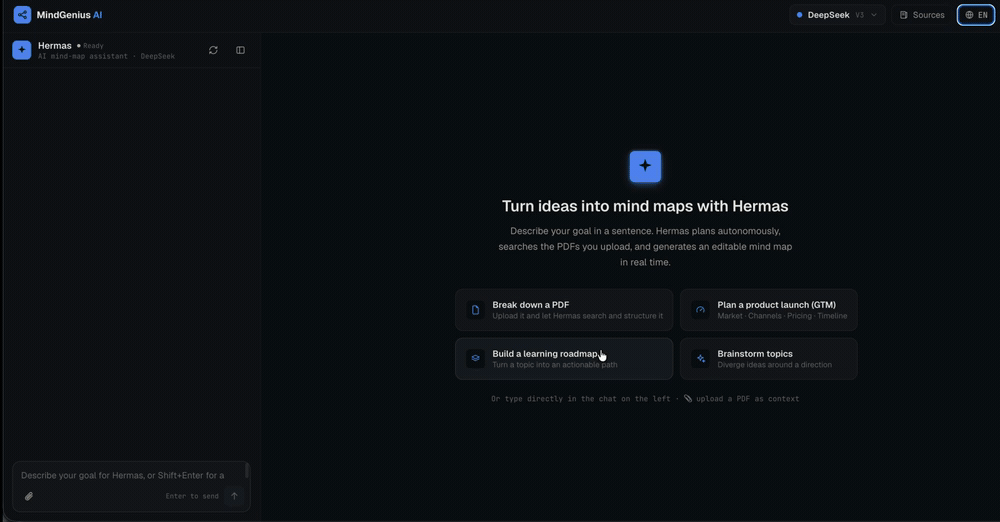

# MindGenius AI

<p>
  <a href="https://mindgenius.onrender.com"></a>
  <a href="https://github.com/xianjianlf2/MindGeniusAI/actions/workflows/ci.yml"></a>
  <a href="LICENSE"></a>
  <a href="package.json"></a>
  <a href="https://github.com/xianjianlf2/MindGeniusAI/pulls"></a>
</p>

**English** · [简体中文](README.zh-CN.md)

Talk to **Hermas** — an autonomous agent that plans, retrieves your documents, and draws editable mind maps for you, with every tool call visible in real time.

> 🔗 **[Live demo →](https://mindgenius.onrender.com)** — bring your own OpenAI / Claude / DeepSeek / Kimi key; it never leaves your browser. _(free tier — first load may take ~30s to wake)_

## Demo



> Type a goal → Hermas plans and calls its tools → the editable mind map grows on the canvas. Try it on the **[live demo](https://mindgenius.onrender.com)**.

## Why it's different

**🤖 A real agent, not a prompt wrapper.** Most "AI mind map" tools do a single prompt → markdown → render. Hermas runs a multi-step tool-calling loop (Vercel AI SDK v5): it decides on its own to search your uploaded PDF (`rag_query`), generate the map structure (`mindmap_generate`), and expand branches (`node_expand`) — chained automatically, with each step shown live as an expandable tool card (input/output included).

**✏️ It edits the map you're already working on — surgically.** Ask "rename the pricing branch" or "add a competitor-analysis node under Market" and Hermas calls `mindmap_edit`, emitting precise `add`/`update`/`remove` operations against your live canvas. It patches the exact nodes by id instead of regenerating the whole map — so your manual tweaks survive, and you watch the canvas change in place.

**📄 It reads your documents while drawing.** Attach a PDF from the composer (📎): upload → chunk → embed → in-memory vector index, all in ~100 lines without LangChain. Hermas cites retrieved passages and incorporates them into the map.

**🔑 Bring your own key, keep your privacy.** OpenAI / Anthropic (Claude) / DeepSeek / Kimi (Moonshot) — or any OpenAI-compatible endpoint (set base URL + model in Settings, e.g. a local Ollama or a custom gateway). Switchable at runtime. Keys live only in your browser's localStorage and are sent per-request to *your own* backend — never stored server-side.

> ℹ️ DeepSeek and Kimi don't serve embeddings, so PDF retrieval (`rag_query`) auto-degrades under them — mind-map generation is unaffected. To keep RAG on with those models, point `EMBEDDING_API_KEY` at any OpenAI-compatible embeddings endpoint (see `apps/server/.env.example`).

**🔁 Rebuilt without breaking anything.** The stack was migrated from Vue/Koa/LangChain to React/Hono/AI SDK incrementally: the legacy SSE envelope `{status, data}` and every old endpoint still work — agent events are layered inside the existing protocol (`packages/shared`), not bolted on beside it.

**🎨 A focused single workbench.** Chat panel + editable X6 canvas + document drawer in one screen. Add/rename/delete nodes, AI-brainstorm any branch, undo/redo, and export to **PNG / SVG / Markdown / OPML**. Your map and chat **persist across refreshes**, the layout **adapts down to tablet**, and the UI is **bilingual (English / 中文)**. Dark, restrained design system with zero UI-framework dependency (custom tokens & components — no antd).

## Architecture

```
├── apps/
│   ├── web/        # React 18 + Vite + Zustand + AntV X6 (custom design system)
│   └── server/     # Hono + Vercel AI SDK v5 (Hermas agent, RAG, SSE streaming)
└── packages/
    └── shared/     # SSE / agent-event protocol shared by both ends
```

- **Agent loop**: `streamText` + `stopWhen: stepCountIs(8)`, four zod-typed tools (`mindmap_generate` / `node_expand` / `rag_query` / `mindmap_edit`)
- **Live canvas edits**: `mindmap_edit` returns structured `add`/`update`/`remove` ops applied to the existing tree by node id — no full re-render, so manual edits are preserved
- **RAG**: pdf-parse → overlap chunking (tested) → `embedMany` → cosine retrieval, in-process
- **Multi-provider**: resolved per request from `Authorization` / `X-LLM-Provider` / `OpenAI-proxy` headers
- **CI**: lint → typecheck → test → build on every push; workspace-aware Docker builds

See [docs/REFACTOR_PLAN.md](docs/REFACTOR_PLAN.md) for the full design.

## Getting Started

Requirements: Node.js >= 20, pnpm >= 9

```bash
pnpm install
pnpm setup     # interactive wizard — pick a provider, paste a key, writes apps/server/.env
pnpm dev       # web on :5173, api on :3000
```

`pnpm setup` is the no-config-file path: it asks which model provider you want and your API key, then generates `apps/server/.env` for you. Prefer to do it by hand? Copy `apps/server/.env.example` to `apps/server/.env` and edit it.

> 🔑 You can also skip the key entirely at setup time and paste it later in the app's **Settings** (top-right) — keys entered there live only in your browser's localStorage.

### Run it in one command (Docker)

The whole app ships as **one image** — the server builds and serves the web bundle alongside the API, so there's nothing to wire up. No Node toolchain needed:

```bash
docker run -p 3000:3000 -e OPENAI_API_KEY=sk-... ghcr.io/xianjianlf2/mindgeniusai   # then open http://localhost:3000
```

Or build locally with Compose:

```bash
cp apps/server/.env.example apps/server/.env   # or run `pnpm setup`
docker compose up --build   # everything on http://localhost:3000
```

You can also omit the key entirely and let each visitor bring their own from the in-app **Settings** panel.

### One-click demo (free)

[](https://huggingface.co/new-space?sdk=docker&name=mindgenius)

Free on Hugging Face Spaces (Docker, 16 GB RAM). Point the Space at this repo's `Dockerfile`, keep its frontmatter `sdk: docker` / `app_port: 3000`, then set `OPENAI_API_KEY` as a Space secret — or leave it empty for bring-your-own-key.

### Usage analytics (optional, zero-cost)

Want to know how many people use the demo without paying for tokens or breaking the privacy promise? Because visitors bring their own keys, your only cost is hosting — and analytics can stay free and cookieless too. Set a provider via the web build env (see `apps/web/.env.example`):

- **Umami Cloud / GoatCounter** — one script counts both page views (PV/UV) **and** a custom `agent_run` event (fired when someone actually generates a map). Recommended if you want the "real usage" number.
- **Cloudflare Web Analytics** — pairs naturally with Cloudflare Pages, but counts page views only (no custom events).

Only counts are sent — never chat content, PDFs, or API keys. Unset = no-op.

## Scripts

| Command | Description |
| --- | --- |
| `pnpm setup` | interactive first-run config wizard (writes `apps/server/.env`) |
| `pnpm dev` | run web + server in parallel |
| `pnpm build` | typecheck & build all packages |
| `pnpm test` | run vitest workspace |
| `pnpm lint` | eslint |

## License

[MIT](LICENSE)

## Star History

[](https://star-history.com/#xianjianlf2/MindGeniusAI&Date)
